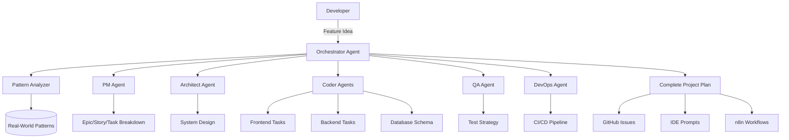

# 🎨 PrismCode

> **Refracting ideas into brilliant code**

AI-powered multi-agent project orchestration platform that transforms feature ideas into complete, production-ready projects through intelligent agent collaboration.


[](https://opensource.org/licenses/MIT)
[](https://www.typescriptlang.org/)
[](https://github.com/pkurri/prismcode/issues)
[](http://makeapullrequest.com)

---

## ✨ What is PrismCode?

Like a prism refracts light into a spectrum of colors, **PrismCode** breaks down your project ideas into organized, executable components through a symphony of specialized AI agents:

- 🏗️ **Architect Agent** - Designs system architecture & data models
- 💻 **Coder Agents** - Frontend, Backend, Database specialists
- 🧪 **QA Agent** - Testing strategies & quality assurance
- 🚀 **DevOps Agent** - CI/CD pipelines & deployment automation
- 📋 **PM Agent** - Project planning & epic/story/task breakdown
- 🎭 **Orchestrator** - Coordinates all agents seamlessly

---

## 🎯 Key Features

### **Multi-Agent Orchestration**
- ✅ **80+ specialized capabilities** across architecture, development, and operations
- ✅ **Context-aware collaboration** between agents
- ✅ **Pattern recognition** from real-world production systems
- ✅ **Zero hallucinations** - only proven, verifiable patterns

### **GitHub Native Integration**
- ✅ **Auto-generate Issues** - Epics, Stories, Tasks with full context
- ✅ **Project automation** - Custom fields, auto-labeling, dependencies
- ✅ **CI/CD workflows** - GitHub Actions templates
- ✅ **GraphQL API integration** - Advanced project manipulation

### **Developer Experience**
- ✅ **Cursor/Windsurf IDE prompts** - Context-rich instructions
- ✅ **n8n workflow templates** - No-code automation
- ✅ **Multi-repo management** - Sync patterns across projects
- ✅ **Real-time collaboration** - Team-based workflows

### **Production-Ready Output**
- ✅ **Complete architecture** - Frontend, backend, database, infra
- ✅ **API contracts** - OpenAPI/GraphQL specs
- ✅ **Security by default** - OWASP Top 10 compliance
- ✅ **Scalability patterns** - Enterprise-grade design

---

## 🚀 Quick Start

### **1. Clone the Repository**

```bash
git clone https://github.com/pkurri/prismcode.git
cd prismcode
```

### **2. Install Dependencies**

```bash
npm install
# or
pnpm install
```

### **3. Configure GitHub Token**

```bash
cp .env.example .env
# Add your GitHub Personal Access Token
echo "GITHUB_TOKEN=your_token_here" >> .env
```

### **4. Initialize Your First Project**

```bash
npm run plan -- --feature "Build a recipe sharing app with AI meal planning"

# Or use the interactive CLI
npm run plan:interactive
```

### **5. Review Generated Output**

```bash
output/
├── project-plan.md          # Complete feature analysis
├── github-issues.json       # Ready to import to GitHub
├── architecture.md          # System design
├── n8n-workflow.json       # Automation workflow
└── cursor-prompts/         # IDE-ready instructions
```

---

## 📋 Usage Examples

### **Example 1: SaaS Application**

```bash
npm run plan -- \
  --feature "Multi-tenant task management with real-time collaboration" \
  --tech-stack "React,Node.js,PostgreSQL,Redis" \
  --scale startup \
  --output-format both
```

**Output**: 25+ GitHub issues organized into epics (Authentication, Real-time Sync, Multi-tenancy, Billing)

### **Example 2: Mobile App**

```bash
npm run plan -- \
  --feature "Fitness tracking app with AI workout recommendations" \
  --tech-stack "React Native,Python,MongoDB" \
  --target-platform mobile \
  --integrations "Stripe,HealthKit,Google Fit"
```

**Output**: Complete architecture with native integrations, CI/CD for iOS/Android

### **Example 3: API-First Project**

```bash
npm run plan -- \
  --feature "GraphQL API for e-commerce with inventory management" \
  --tech-stack "GraphQL,Go,PostgreSQL" \
  --api-style graphql \
  --generate-sdk true
```

**Output**: Full GraphQL schema, resolvers, subscriptions, SDK generation

---

## 🏗️ Architecture



---

## 📚 Documentation

### **Core Guides**
- [Getting Started](docs/getting-started.md) - Complete setup guide
- [Agent System](docs/agents/README.md) - How agents work together
- [GitHub Integration](docs/github-integration.md) - Automation patterns
- [CLI Reference](docs/cli-reference.md) - All commands and options

### **Agent Documentation**
- [Architect Agent](docs/agents/architect.md) - System design capabilities
- [Coder Agents](docs/agents/coder.md) - Development specializations
- [QA Agent](docs/agents/qa.md) - Testing strategies
- [DevOps Agent](docs/agents/devops.md) - CI/CD automation
- [PM Agent](docs/agents/pm.md) - Project planning

### **Advanced Topics**
- [Custom Agents](docs/advanced/custom-agents.md) - Build your own
- [Pattern Database](docs/advanced/patterns.md) - Real-world references
- [Multi-Repo Setup](docs/advanced/multi-repo.md) - Manage multiple projects
- [n8n Integration](docs/advanced/n8n.md) - Workflow automation

---

## 🎨 Project Examples

See complete working examples in the [`examples/`](examples/) directory:

- **[Recipe SaaS](examples/recipe-saas/)** - Full-stack application with AI features
- **[Kanban Board](examples/kanban-app/)** - Real-time collaboration tool
- **[E-commerce API](examples/ecommerce-api/)** - GraphQL backend with payments
- **[Mobile Fitness App](examples/fitness-mobile/)** - React Native with HealthKit

Each example includes:
- Complete project plan
- GitHub issues JSON
- Architecture documentation
- n8n workflows
- Cursor IDE prompts

---

## 🤝 Contributing

We welcome contributions! See [CONTRIBUTING.md](CONTRIBUTING.md) for guidelines.

### **Ways to Contribute**

1. **Add Real-World Patterns** - Share proven architectural patterns
2. **Create Agent Templates** - Build specialized agents
3. **Improve Documentation** - Help others understand PrismCode
4. **Report Issues** - Found a bug? Let us know
5. **Submit Examples** - Share your project plans

---

## 🛠️ Technology Stack

- **Runtime**: Node.js 18+, TypeScript 5.3+
- **CLI Framework**: Commander.js
- **GitHub Integration**: Octokit (REST + GraphQL)
- **AI/LLM**: OpenAI, Anthropic Claude, Local models
- **Automation**: n8n workflow templates
- **Testing**: Jest, TypeScript strict mode
- **Documentation**: Markdown, Mermaid diagrams

---

## 📊 Project Status

- ✅ **Phase 1**: Core agent system (COMPLETE)
- ✅ **Phase 2**: GitHub integration (COMPLETE)
- 🚧 **Phase 3**: n8n workflow library (IN PROGRESS)
- 📋 **Phase 4**: Web UI dashboard (PLANNED)
- 📋 **Phase 5**: VS Code extension (PLANNED)

---

## 📄 License

MIT License - see [LICENSE](LICENSE) for details.

---

## 🌟 Star History

[](https://star-history.com/#pkurri/prismcode&Date)

---

## 💬 Community

- **GitHub Discussions**: [Ask questions, share ideas](https://github.com/pkurri/prismcode/discussions)
- **Issues**: [Report bugs, request features](https://github.com/pkurri/prismcode/issues)
- **Twitter**: [@prismcode_ai](https://twitter.com/prismcode_ai)

---

<div align="center">

**Built with ❤️ by developers, for developers**

*Refracting ideas into brilliant code* ✨

[Get Started](docs/getting-started.md) • [Documentation](docs/) • [Examples](examples/) • [Contributing](CONTRIBUTING.md)

</div>