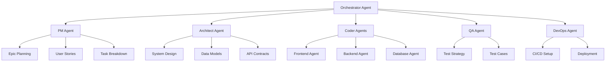

# PrismCode Agent System

## Overview

PrismCode uses a **multi-agent orchestration** system where specialized AI agents collaborate to transform feature ideas into complete project plans.

## Agent Architecture



## Agent Roles

### 1. Orchestrator Agent

**Responsibility**: Coordinates all agents and ensures coherent output.

**Capabilities**:
- Request routing to specialized agents
- Context management across agents
- Conflict resolution
- Final output assembly

**When to Use**: Automatically invoked for every request.

---

### 2. PM (Project Manager) Agent

**Responsibility**: Breaks down features into structured work items.

**Capabilities**:
- Epic creation with business value
- User story generation (As a... I want... So that...)
- Task breakdown with implementation hints
- Dependency identification
- Story point estimation
- Sprint planning

**Output Format**:
- Epics (strategic level)
- Stories (feature level)
- Tasks (implementation level)

**Example**:
```markdown
## [EPIC] User Authentication System

### Stories:
1. [STORY] OAuth 2.0 Integration
2. [STORY] JWT Token Management
3. [STORY] Password Reset Flow

### Tasks:
1. [TASK] Create OAuth callback route
2. [TASK] Implement JWT middleware
```

---

### 3. Architect Agent

**Responsibility**: Designs system architecture and technical infrastructure.

**Capabilities**:
- System architecture design (frontend, backend, database)
- Technology stack recommendations
- Data model creation (ERDs, schemas)
- API contract specification (REST, GraphQL)
- Integration point identification
- Security architecture
- Scalability planning
- Performance optimization patterns

**Output Format**:
- Architecture diagrams (Mermaid)
- Database schemas (TypeScript interfaces, SQL)
- API specifications (OpenAPI, GraphQL schema)
- Technology justifications

**Example**:
```typescript
// Data Model
interface User {
  id: string;
  email: string;
  passwordHash: string;
  oauthProviders: OAuthProvider[];
  createdAt: Date;
}

// API Contract
POST /api/auth/login
Body: { email: string; password: string }
Response: { token: string; user: User }
```

---

### 4. Coder Agents

**Responsibility**: Generate implementation-level technical tasks.

#### 4a. Frontend Agent

**Specializations**:
- React/Vue/Svelte component architecture
- State management (Redux, Zustand, TanStack Query)
- UI/UX implementation
- Responsive design
- Client-side routing
- Form handling and validation

**Output**:
- Component file structure
- State management patterns
- API integration code snippets
- CSS/styling approach

#### 4b. Backend Agent

**Specializations**:
- API endpoint implementation
- Business logic architecture
- Authentication/authorization
- Database queries and ORM usage
- Third-party integrations
- Error handling

**Output**:
- Route definitions
- Controller/service layer code
- Middleware implementations
- Database query examples

#### 4c. Database Agent

**Specializations**:
- Schema design and normalization
- Migration scripts
- Indexing strategies
- Query optimization
- Data seeding

**Output**:
- SQL migration files
- ORM model definitions
- Index creation scripts
- Sample queries

---

### 5. QA (Quality Assurance) Agent

**Responsibility**: Defines testing strategy and quality gates.

**Capabilities**:
- Test pyramid definition (unit, integration, E2E)
- Test case generation
- Acceptance criteria creation
- Performance testing requirements
- Security testing recommendations
- Code coverage targets

**Output Format**:
- Test strategy document
- Unit test examples
- Integration test scenarios
- E2E user journey tests
- Performance benchmarks

**Example**:
```typescript
// Unit Test
describe('AuthService', () => {
  it('should hash passwords with bcrypt', async () => {
    const password = 'secure123';
    const hash = await authService.hashPassword(password);
    expect(hash).not.toBe(password);
    expect(await bcrypt.compare(password, hash)).toBe(true);
  });
});

// Integration Test
it('POST /api/auth/login returns JWT token', async () => {
  const response = await request(app)
    .post('/api/auth/login')
    .send({ email: 'test@example.com', password: 'password123' });
  
  expect(response.status).toBe(200);
  expect(response.body.token).toBeDefined();
});
```

---

### 6. DevOps Agent

**Responsibility**: Creates CI/CD pipelines and deployment automation.

**Capabilities**:
- GitHub Actions workflow creation
- Docker containerization
- Kubernetes manifests
- Environment configuration
- Monitoring and logging setup
- Deployment strategies (blue-green, canary)

**Output Format**:
- `.github/workflows/*.yml` files
- `Dockerfile` and `docker-compose.yml`
- Kubernetes YAML manifests
- Infrastructure as Code (Terraform, CloudFormation)

**Example**:
```yaml
# .github/workflows/ci.yml
name: CI Pipeline

on: [push, pull_request]

jobs:
  test:
    runs-on: ubuntu-latest
    steps:
      - uses: actions/checkout@v4
      - uses: actions/setup-node@v4
        with:
          node-version: '20'
      - run: npm ci
      - run: npm test
      - run: npm run lint
```

---

## Agent Collaboration Flow

### Phase 1: Analysis (Orchestrator + PM)
1. Orchestrator receives feature request
2. PM Agent breaks down into epics/stories/tasks
3. Orchestrator validates hierarchy

### Phase 2: Architecture (Architect)
1. Architect designs system architecture
2. Creates data models and API contracts
3. Identifies technology stack

### Phase 3: Implementation Planning (Coder Agents)
1. Frontend Agent defines component structure
2. Backend Agent designs API routes and business logic
3. Database Agent creates schema and migrations

### Phase 4: Quality Assurance (QA)
1. QA Agent generates test strategy
2. Creates acceptance criteria for all stories
3. Defines performance and security benchmarks

### Phase 5: Deployment (DevOps)
1. DevOps Agent creates CI/CD workflows
2. Generates deployment configurations
3. Sets up monitoring and logging

### Phase 6: Assembly (Orchestrator)
1. Orchestrator combines all agent outputs
2. Resolves conflicts and inconsistencies
3. Generates final deliverables:
   - Complete project plan
   - GitHub issues JSON
   - n8n workflows
   - Cursor IDE prompts

---

## Using Agents Individually

While agents work together automatically, you can invoke them individually:

```bash
# Only PM Agent (planning)
npm run plan -- --agents pm

# Only Architect Agent (design)
npm run plan -- --agents architect

# Multiple specific agents
npm run plan -- --agents "pm,architect,frontend"

# All agents (default)
npm run plan
```

---

## Custom Agent Development

See [Custom Agents Guide](../advanced/custom-agents.md) for creating your own specialized agents.

---

## Agent Configuration

Configure agent behavior in `.prismcode.config.json`:

```json
{
  "agents": {
    "pm": {
      "storyPointScale": "fibonacci",
      "defaultPriority": "medium",
      "epicTemplate": "custom-epic.md"
    },
    "architect": {
      "diagramFormat": "mermaid",
      "apiStyle": "rest",
      "includeSequenceDiagrams": true
    },
    "coder": {
      "frontend": {
        "framework": "react",
        "stateManagement": "zustand"
      },
      "backend": {
        "framework": "express",
        "orm": "prisma"
      }
    },
    "qa": {
      "testFramework": "jest",
      "coverageThreshold": 80
    },
    "devops": {
      "ciProvider": "github-actions",
      "deploymentTarget": "vercel"
    }
  }
}
```

---

## Next Steps

- Read individual agent guides:
  - [PM Agent](pm.md)
  - [Architect Agent](architect.md)
  - [Coder Agents](coder.md)
  - [QA Agent](qa.md)
  - [DevOps Agent](devops.md)
- Explore [Pattern Database](../advanced/patterns.md)
- Learn [Multi-Agent Workflows](../advanced/workflows.md)