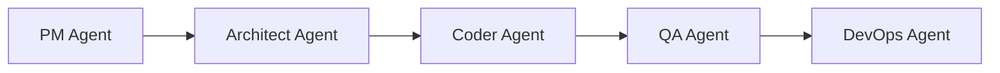
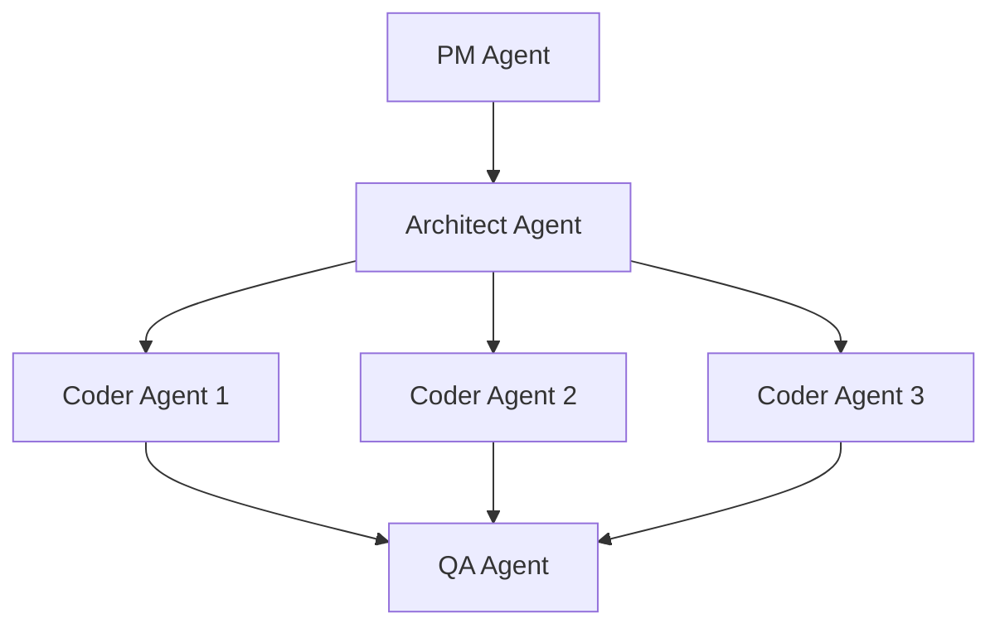

# Agent System Overview

The PrismCode agent system is built around **specialized AI agents** that work together to complete software development tasks.

## Agent Types

### PM Agent (Product Manager)

**Responsibilities**:
- Requirements analysis
- Project planning and breakdown
- Effort estimation
- Sprint planning
- Stakeholder communication

**Input**: Feature descriptions, user stories  
**Output**: Project plans, issue breakdowns, estimates

### Architect Agent

**Responsibilities**:
- System architecture design
- Technology stack selection
- Design patterns and best practices
- Technical decision making
- API design

**Input**: Requirements, constraints  
**Output**: Architecture documents, technical specifications

### Coder Agent

**Responsibilities**:
- Code implementation
- Refactoring
- Code generation
- Bug fixes
- Documentation

**Input**: Specifications, requirements  
**Output**: Working code, tests, documentation

### QA Agent

**Responsibilities**:
- Test planning
- Test case generation
- Bug detection
- Quality validation
- Coverage analysis

**Input**: Code, specifications  
**Output**: Test suites, bug reports, quality metrics

### DevOps Agent

**Responsibilities**:
- CI/CD pipeline setup
- Deployment automation
- Infrastructure management
- Monitoring setup
- Security scanning

**Input**: Application code, requirements  
**Output**: Deployment pipelines, infrastructure as code

## How Agents Collaborate

### Sequential Workflow



Each agent completes its work before passing to the next.

### Parallel Workflow



Multiple agents work simultaneously on independent tasks.

## Agent Base Class

All agents extend the `BaseAgent` class:

```typescript
export abstract class BaseAgent {
  protected name: string;

  constructor(name: string) {
    this.name = name;
  }

  abstract process(input: any): Promise<AgentOutput>;

  getName(): string {
    return this.name;
  }
}
```

## Agent Configuration

Configure agents in your `.env`:

```bash
# AI Provider
OPENAI_API_KEY=your_key_here
ANTHROPIC_API_KEY=your_key_here

# Agent Settings
AGENT_TIMEOUT=300000
AGENT_MAX_RETRIES=3
AGENT_PARALLEL_LIMIT=5
```

## Best Practices

### 1. Clear Input/Output Contracts
Each agent should have well-defined inputs and outputs.

### 2. Idempotent Operations
Agents should be safe to retry without side effects.

### 3. Comprehensive Logging
Use structured logging for debugging and monitoring:

```typescript
import { loggers } from '@/utils/logger';

loggers.agent('PM Agent', 'Planning project', {
  feature: 'auth',
  complexity: 'medium'
});
```

### 4. Error Handling
Agents should gracefully handle errors:

```typescript
import { captureException } from '@/utils/sentry';

try {
  await agent.process(input);
} catch (error) {
  captureException(error, { agent: agent.getName() });
  throw error;
}
```

## Next Steps

Learn about specific agents:
- [PM Agent](/agents/pm-agent)
- [Architect Agent](/agents/architect-agent)
- [Coder Agent](/agents/coder-agent)
- [QA Agent](/agents/qa-agent)
- [DevOps Agent](/agents/devops-agent)
